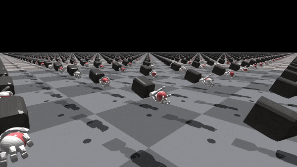

# faive_gym
IsaacGym environments for the Faive Hand (and also somewhat easily extendable to other robotic hands), intended to be used together with [IsaacGymEnvs](https://github.com/NVIDIA-Omniverse/IsaacGymEnvs)


## Resources

* [Original Faive Gym Work from SRL @ ETH Zürich](https://github.com/srl-ethz/faive_gym_oss): The original repo containing the main instruction for the RL part of this project. Provided by the Soft Robotics Lab of ETH Zürich.
* [faive_gym tutorial video](https://www.youtube.com/watch?v=Nwa7xP3RtO0): A video tutorial on how to get started with the faive_gym library to train a policy with RL, configure the environment, and load your own robot model in the framework.
* [faive_gym tips document](https://docs.google.com/document/d/1n91q4nECS4vzkC2Jn62DxLiTA15WmdjJsbqNxEuv4tE/edit?usp=sharing): shared Google doc with tips on how to use the library effectively.
* [RL knowledge dump document](https://docs.google.com/document/d/1mLH4pmkmL0SE-hknsB_qGlR9QBu4GYbEzk0ho16TDC4/edit?usp=sharing): another shared Google doc with general tips about RL for manipulation

## Content


## Other comments
Don't forget to read the paper for the SRL about the main project this work is derived from. This project is for a class backed on their academic work, so all the credit is their, not our.
```
@misc{toshimitsu2023getting,
	title={Getting the Ball Rolling: Learning a Dexterous Policy for a Biomimetic Tendon-Driven Hand with Rolling Contact Joints}, 
	author={Yasunori Toshimitsu and Benedek Forrai and Barnabas Gavin Cangan and Ulrich Steger and Manuel Knecht and Stefan Weirich and Robert K. Katzschmann},
	year={2023},
	eprint={2308.02453},
	archivePrefix={arXiv},
	primaryClass={cs.RO}
}
```
